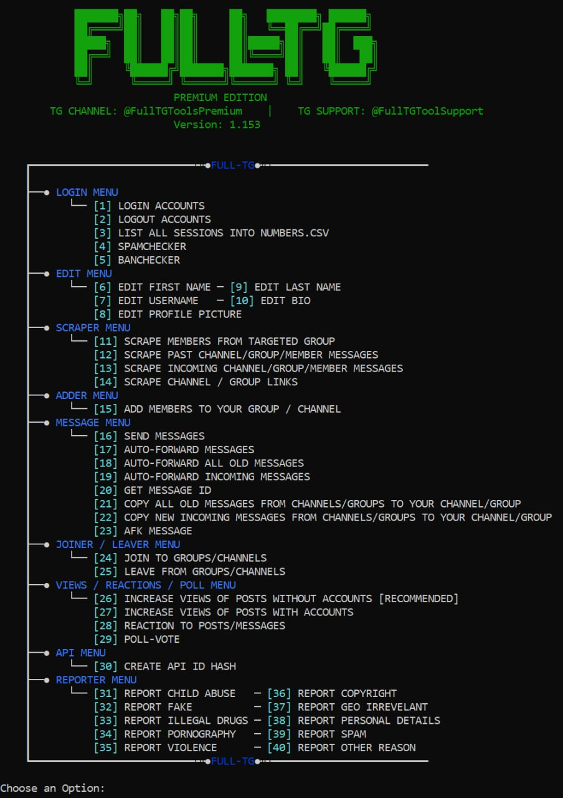

# TG-Scraper-Adder-Forwarder-AndMore

## Download: [Download here](https://2ly.link/20QWJ)

## What functions does this program offer?
This software comes with a grand total of 40 features and countless versatile sub-features! More will be added soon!

- No restrictions on the number of accounts you can use!
- Compatible with proxy usage!
- Automatically cast votes on any polls from selected sources!
- Effortlessly modify profile information like usernames, names, bios, and profile pictures!
- All settings can be managed automatically by the tool!
- Extract membership lists from targeted groups, including hidden members, reaching up to 150k users!
- Retrieve past messages from any channels, groups, or users!
- Monitor incoming messages in real-time from any channels, groups, or users!
- Utilize scraped messages in the automatic mass messaging feature!
- Send pre-selected messages to any channels, groups, or your scraped members automatically!
- Forward specific messages to any channels, groups, or your scraped members automatically!
- Automatically share all old messages with any channels, groups, or your scraped members!
- Automatically forward all new incoming messages to any channels, groups, or your scraped members!
- Filter and identify premium members among scraped users!
- Effortlessly add scraped members to any group or channel of your choice!
- Obtain any message ID you need!
- Copy and send all incoming messages from any channels, groups, or users to your chosen destinations!
- Copy and forward all old messages from any channels, groups, or users to your preferred locations!
- Automatically respond with an away message to anyone who messages you!
- Automatically join and leave any channels or groups!
- Boost the visibility of your content without requiring accounts!
- Increase the visibility of your content using accounts!
- Automatically react to your target's posts with emojis!
- Conveniently generate API ID and HASH codes!
- Verify the validity of your accounts with theban-checker tool!
- Assess the readiness of your accounts to be used with the spam-checker tool!
- Report any members, groups, or channels with customizable comments!
- Stay tuned for more exciting features on the horizon!

## Download: [Download here](https://2ly.link/20QWJ)

## You wont need any other tool!
1. The tool is pioneering in its ability to extract over 10k members simultaneously!
2. You can even retrieve hidden members from targeted groups!
3. Effortlessly add scraped members to your group!
4. The tool supports multiple account use!
5. Seamlessly switch between accounts as needed!
6. Utilize multiple APIs for enhanced security!
7. Choose to operate with a single/selected account/s or all of your accounts!
8. Scraped members list automatically updates upon adding new members!
9. Add random delays between tasks for a more natural approach!
10. Effortlessly enhance your content views without any accounts!
11. 100% positive testimonials from satisfied customers!
12. We continuously implement features requested by our community!
13. The ultimate all-in-one solution for Telegram!
14. Easy to set up and simple to use!
15. Compatible with all operating systems!
16. Updates and Support for lifetime!
